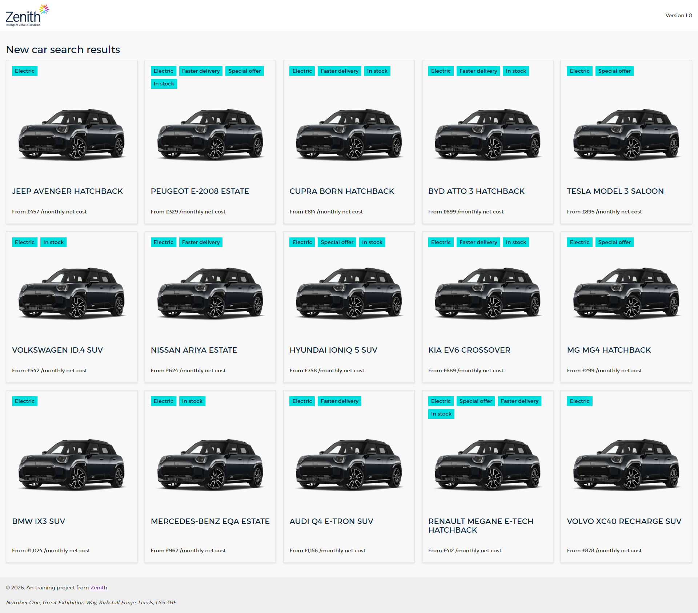
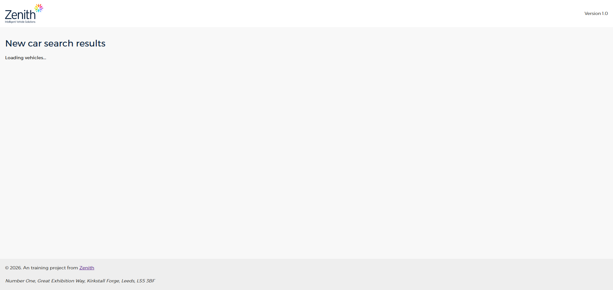
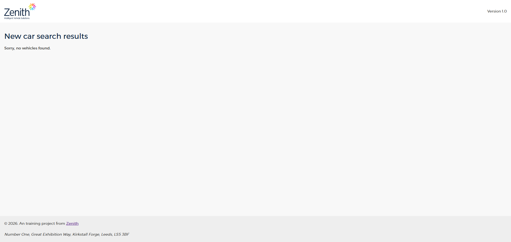
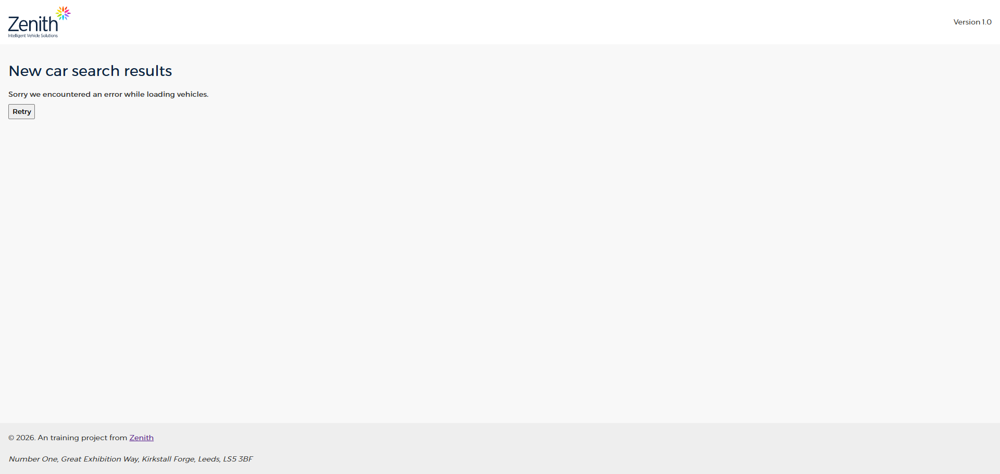

# 01 - Vehicle Search

## Description

**AS A** driver  
**I WANT** to be able to view a list of vehicles available to me  
**SO THAT** I can find a vehicle which I can have on my company's salary sacrifice scheme

We wish to present the users (drivers) of our salary sacrifice portal with a full list of vehicles that are available to them. Further backlog items will allow them to filter these results based on their specific wants & needs and navigate to view further details, but for now we require a basic list to be shown.

## Developer Notes

The existing data service (VehiclesDataService) provides a method (findVehicles) that allows results to be retrieved from the API.

There are 2 components already developed for the UI that can be used to display the data. They are found in:

- src\app\domain\vehicles\ui\vehicle-card
- src\app\domain\vehicles\ui\vehicle-list

## Acceptance Criteria

### AC 1

**GIVEN** I am on the vehicle search page  
**WHEN** the page loads  
**THEN** there should be a heading with the text "New car search results"  
**AND** I am presented with a full list of available vehicles  
**AND** there should be 40 results returned

### AC 2

**GIVEN** I am on the vehicle search page  
**WHEN** the page is fetching vehicle data that is not yet loaded  
**THEN** I am presented with a message saying "Loading vehicles..."

### AC 3

**GIVEN** I am on the vehicle search page  
**WHEN** the page has fetched vehicle data but there are no results  
**THEN** I am presented with a message saying "Sorry, no vehicles found."

### AC 4

**GIVEN** I am on the vehicle search page  
**WHEN** the page has attempted to fetch vehicle data but has received an api error  
**THEN** I am presented with a message saying "Sorry we encountered an error while loading vehicles."  
**AND** a button with the text "Retry" allowing me to request the page to try loading vehicle data again

